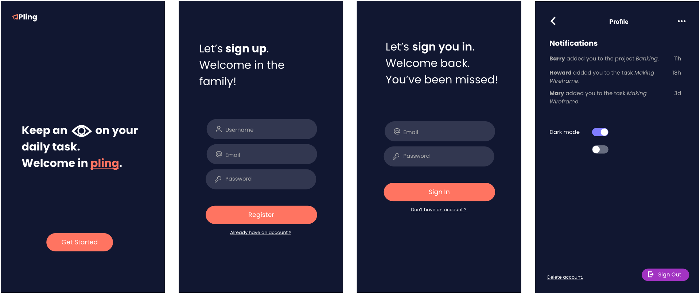

## What is Pling ?
Pling is a mobile project management application. This application was developed as part of the “Embedded Interface Programming” course. Pling should include all the necessary and minimal features for planning a project, such as creating a project, adding tasks and monitoring progress. 

## Developpers
•	CALVADOS Cindy
•	CHAUMULON Cassandra

## Features
•	Register and unregister a user,
•	Authenticate a user,
•	Delete your account,
•	Create / edit / delete a project: a project consists of a title, a description, an end date, a list of tasks and a team,
•	Add a task to a project (create / edit / delete): a task has a title, a description, a start date, an end date and the person to whom it has been assigned,
•	Filter project tasks by their status: a task has 4 possible states: to do, in progress or completed,
•	Make users who have an account collaborate: search for a user and add them to a project or task,
•	Monitor the progress of each project: reporting screen with graphs and/or percentage of progress, but also counters for ongoing and completed tasks,
•	Search for projects or tasks via a search bar,
•	See the tasks planned for a given day: all tasks of the day, across all projects, are displayed,
•	Get notifications in the app when a user has added or removed us from a task or project,
•	Adapt the language of the application (English by default, or French),
•	Have a dark mode of the application,
•	Manage your account: change your password or email address, 
•	Manage a team on a project: add and delete users.

## Mock-ups
### Light mode

#### Authentification 

#### Navigation

#### Projects and tasks

### Dark mode

#### Authentification 

#### Navigation

#### Projects and tasks

